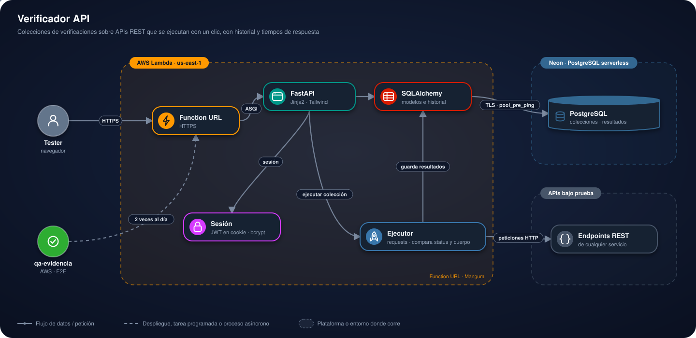

# Verificador API

<p>
  <a href="https://eofvlnitsiuodup4eywdcenxwu0adgbz.lambda-url.us-east-1.on.aws/"></a>
  <a href="https://frontend-nine-topaz-99.vercel.app"></a>
  <a href="https://d4i3vsgw7xwmh.cloudfront.net"></a>
</p>


## Contenido

1. [Presentación](#1-presentación)
2. [Estructura del proyecto](#2-estructura-del-proyecto)
3. [Arquitectura](#3-arquitectura)
4. [Plataformas y su función](#4-plataformas-y-su-función)
5. [Cómo usar la plataforma](#5-cómo-usar-la-plataforma)
6. [Instalación para pruebas](#6-instalación-para-pruebas)
7. [Autor y licencia](#7-autor-y-licencia)

---

## 1. Presentación

Herramienta de automatización de pruebas de API: define colecciones de
verificaciones (método, URL, headers, body, status y contenido
esperados) y ejecútalas con un clic, con historial de resultados y
tiempos de respuesta — una versión propia y simplificada de lo que hace
Postman/Newman.

### En pocas palabras

- **Qué hace:** sirve para comprobar que una API funciona. Anotas qué petición
  hacer (por ejemplo `GET /usuarios/1`) y qué esperas recibir (código 200, cierto
  texto en la respuesta); luego ejecutas toda la colección con un clic y ves
  qué pasó, qué falló y cuánto tardó cada una.
- **Para qué sirve:** detectar rápido si un cambio rompió algo, y guardar un
  historial de resultados como evidencia de pruebas.
- **Cómo probarlo:** entra a la [demo](https://eofvlnitsiuodup4eywdcenxwu0adgbz.lambda-url.us-east-1.on.aws/),
  crea una cuenta, arma una colección y ejecútala. Para correrlo en tu equipo,
  ve a [Instalación para pruebas](#6-instalación-para-pruebas).

### Demo en vivo

**Aplicación:** [abrir la demo en vivo](https://eofvlnitsiuodup4eywdcenxwu0adgbz.lambda-url.us-east-1.on.aws/)

---

## 2. Estructura del proyecto

```
app/
├── main.py            Arranque de FastAPI y registro de routers
├── database.py         Conexión a PostgreSQL (Neon)
├── models.py            Usuario, Colección, Prueba, Ejecución, ResultadoPrueba
├── seguridad.py          JWT en cookie httponly + bcrypt
├── dependencias.py        Control de acceso: cada cuenta accede a lo suyo
├── ejecutor.py            Corre las pruebas de una colección con requests
├── routers/               web (inicio), auth, colecciones, ejecuciones
└── templates/             Jinja2 + Tailwind, tema claro/oscuro
```

---

## 3. Arquitectura

<p align="center">
  
</p>

- Las páginas usan Jinja2 + Tailwind y la sesión viaja en un JWT dentro de una
  cookie.
- El **ejecutor** recorre la colección, llama a cada endpoint con `requests` y
  compara el código de estado y el contenido con lo esperado.
- **SQLAlchemy** guarda colecciones, pruebas y resultados en PostgreSQL, por TLS
  y con `pool_pre_ping` para sobrevivir a la suspensión por inactividad.

### Cómo se conecta a la base de datos

El proyecto usa PostgreSQL alojado en [Neon](https://neon.tech) (Postgres
serverless). La conexión se resuelve en un solo lugar,
`app/database.py`, a partir de la variable `DATABASE_URL` del `.env`:

```python
engine = create_engine(DATABASE_URL, pool_pre_ping=True)
```

Dos detalles importan por tratarse de Neon específicamente:

- **La cadena de conexión ya debe traer `?sslmode=require`** al final —
  Neon exige TLS y así te la entrega su panel (Dashboard → tu proyecto →
  *Connection Details* → *Connection string*, variante *Pooled
  connection*).
- **`pool_pre_ping=True`** es necesario porque Neon
  "suspende" el cómputo tras un rato sin actividad (scale-to-zero). Sin
  esto, una conexión que quedó abierta antes de esa suspensión falla con
  un error confuso a mitad de un request en vez de renovarse sola.

---

## 4. Plataformas y su función

| Plataforma | Función en el proyecto |
|---|---|
|  | Ejecuta la app FastAPI (con Mangum) detrás de una Function URL, sin API Gateway. |
|  | PostgreSQL serverless en Neon: guarda usuarios, colecciones, pruebas, ejecuciones y resultados. Se suspende sola sin actividad. |
|  | Prueba la demo automáticamente dos veces al día y publica la evidencia. |

---

## 5. Cómo usar la plataforma

### 5.1 Crear una cuenta

1. En la página de inicio, pulsa **Crear cuenta**.
2. Completa **Nombre**, **Correo** y **Contraseña**.
3. Pulsa **Crear cuenta**. La cuenta queda lista para usar de inmediato.

### 5.2 Iniciar sesión

1. Pulsa **Iniciar sesión**, escribe **Correo** y **Contraseña** y pulsa **Entrar**.
2. Llegas a **Mis colecciones**, donde solo ves tus propias colecciones.

### 5.3 Crear una colección

1. En **Mis colecciones**, pulsa **+ Nueva colección**.
2. Completa el formulario:

   | Campo | Dato |
   |---|---|
   | Nombre | Nombre de la colección, por ejemplo "API de reservas-corferias" |
   | Descripción (opcional) | Para qué sirve |
   | URL base (opcional) | Dirección común de la API, por ejemplo `https://mi-api.onrender.com` |

3. Pulsa **Crear**.

### 5.4 Agregar pruebas

1. Dentro de la colección, pulsa **+ Agregar prueba**.
2. Completa el formulario:

   | Campo | Dato |
   |---|---|
   | Nombre | Qué verifica, por ejemplo "Listar casas" |
   | Método | GET, POST, PUT, PATCH o DELETE |
   | Ruta o URL | Ruta relativa a la URL base (`/house`) o una URL completa |
   | Headers (JSON, opcional) | Cabeceras de la solicitud |
   | Body (JSON, opcional) | Cuerpo de la solicitud |
   | Status esperado | Código HTTP esperado, por ejemplo `200` |
   | La respuesta debe contener (opcional) | Texto que debe aparecer en la respuesta |

3. Pulsa **Guardar prueba**. La tabla de **Pruebas** muestra nombre, método, ruta y
   status esperado; **Borrar** elimina una prueba.

### 5.5 Ejecutar la colección

1. Pulsa **▶ Ejecutar todo**.
2. Se abre el detalle de la ejecución: cada prueba con su resultado, su tiempo de
   respuesta en milisegundos y, si falló, el motivo.
3. **Ejecuciones recientes** guarda el historial de la colección como evidencia.

---

## 6. Instalación para pruebas

```bash
python -m venv .venv
.venv\Scripts\Activate.ps1        # Windows
source .venv/bin/activate         # Linux o macOS

pip install -r requirements.txt
cp .env.example .env
```

Completa el `.env` con tu cadena de conexión de Neon y un `JWT_SECRET`
propio. Las tablas se crean solas al arrancar (no usa Alembic todavía).

```bash
uvicorn app.main:app --reload --port 8300
```

Abre `http://127.0.0.1:8300` y crea tu cuenta.

### Despliegue

La instancia pública corre en AWS Lambda (Function URL, sin API Gateway),
con PostgreSQL en Neon como base de datos.

---

## 7. Autor y licencia

**Luis Felipe Arias Carriazo**
[GitHub](https://github.com/lariasca1994) · [LinkedIn](https://linkedin.com/in/lfac1)

Licencia: MIT.
